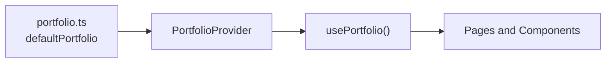
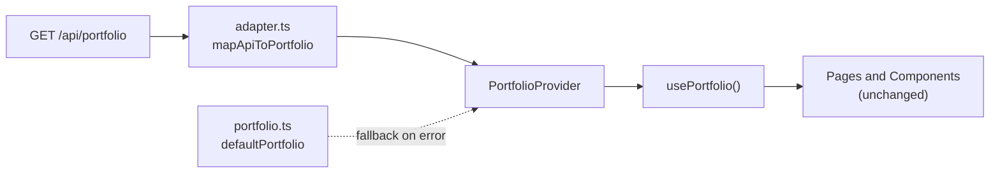
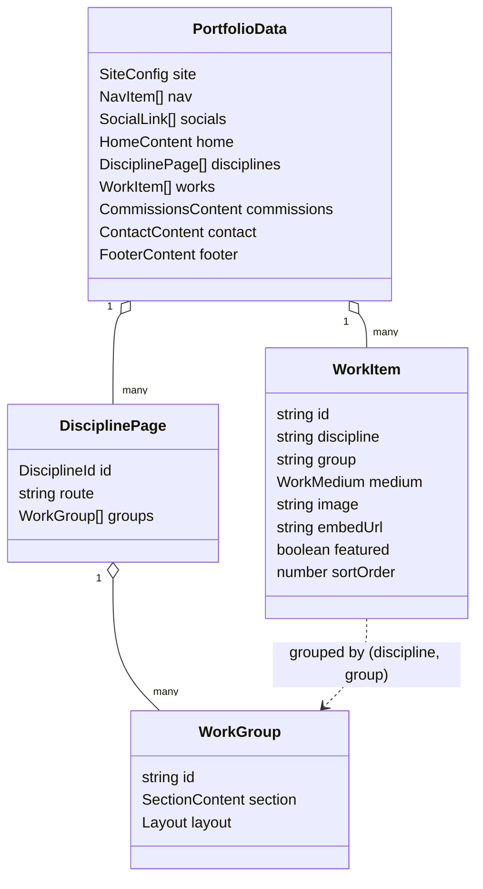
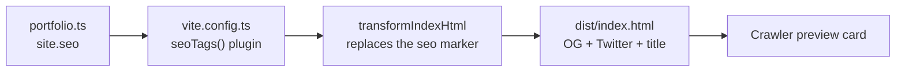
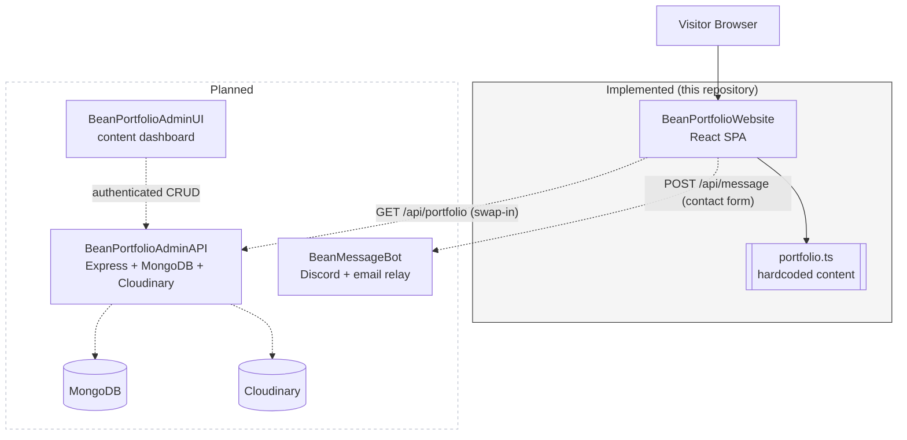
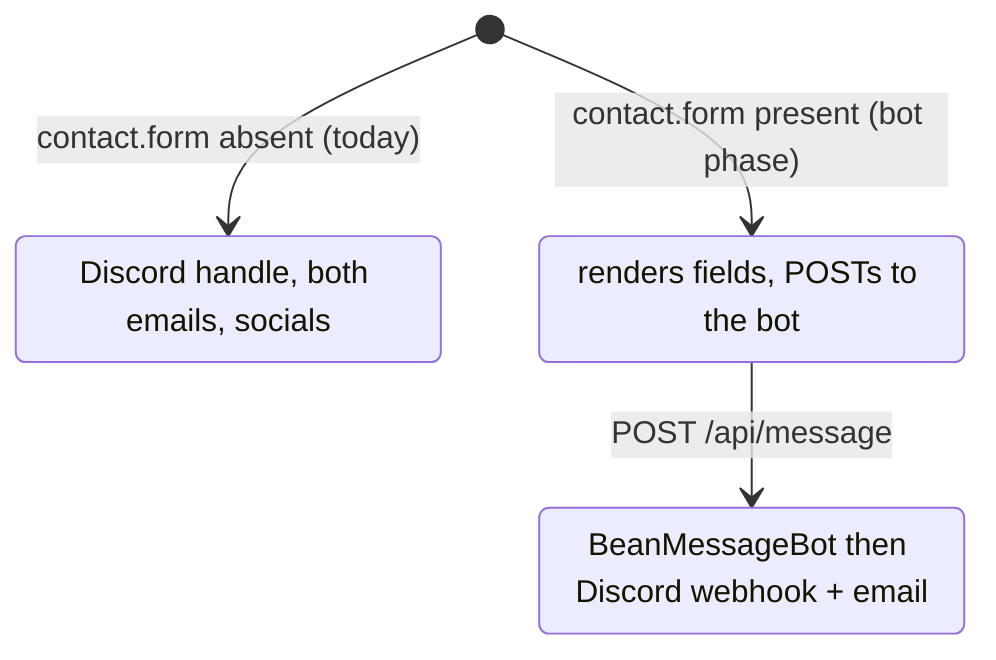

# BeanPortfolioWebsite

The public portfolio site for Raybean — graphic designer, illustrator, video
editor, and osu! storyboarder. A single-page React application whose content is
fully data-driven and architected to move from hardcoded data to a CMS-backed
API without rewriting the interface.

- **Live:** https://portfolio.raybean.cc
- **Stack:** Vite + React 19 + TypeScript + Tailwind CSS v4

---

## Table of Contents

- [Overview](#overview)
- [Tech Stack](#tech-stack)
- [Getting Started](#getting-started)
- [Project Structure](#project-structure)
- [The Content Layer](#the-content-layer)
- [Domain Model](#domain-model)
- [Rendering Pipeline](#rendering-pipeline)
- [SEO and Social Embeds](#seo-and-social-embeds)
- [Assets](#assets)
- [Deployment](#deployment)
- [System Architecture and Roadmap](#system-architecture-and-roadmap)
- [Configuration Reference](#configuration-reference)

---

## Overview

This repository is the frontend only. It renders entirely from a single typed
content module today, and is built so that a future admin API can supply the
same content with no component changes. The two later products — an admin
dashboard for editing content and a message bot for the contact form — are
designed for but intentionally not implemented here.

Principles the codebase holds to:

| Principle | Implementation |
| --- | --- |
| Content is data, not markup | Every visitor-facing string lives in `src/content/portfolio.ts`. No component imports it directly. |
| One seam for the backend | Components read a React context; whether it is fed by local data or an API is invisible to them. |
| Presentation chosen by data | A section declares its own `layout` (`carousel`, `masonry`, `grid`, `video-grid`); adding a discipline is a content edit. |
| Fail soft | A missing image degrades to a palette gradient; a failed API call falls back to local content. The page can never render blank. |
| Tokens once | Palette and fonts are defined once in `@theme`; components use utilities, never raw hex. |

---

## Tech Stack

| Concern | Choice | Version |
| --- | --- | --- |
| Build tool | Vite | 8 |
| UI library | React | 19 |
| Language | TypeScript | 6 |
| Styling | Tailwind CSS (via `@tailwindcss/vite`, no config file) | 4 |
| Routing | React Router | 7 |
| Animation | Framer Motion | 12 |
| Icons | Phosphor Icons + a local SVG sprite | 2 |
| Linting | ESLint (typescript-eslint, react-hooks, react-refresh) | 10 |
| Hosting | Vercel | — |

There is no `tailwind.config.js` and no PostCSS config; Tailwind v4 is driven
entirely by the Vite plugin and the `@theme` block in `src/index.css`.

---

## Getting Started

Requires Node 20+.

```bash
npm install       # install dependencies
npm run dev       # start the dev server (http://localhost:5173)
npm run build     # type-check (tsc -b) and produce a production build in dist/
npm run preview   # serve the production build locally
npm run lint      # run ESLint
```

| Script | Command | Purpose |
| --- | --- | --- |
| `dev` | `vite` | Dev server with HMR |
| `build` | `tsc -b && vite build` | Type-check then bundle to `dist/` |
| `preview` | `vite preview` | Serve the built output |
| `lint` | `eslint .` | Lint the project |

---

## Project Structure

```
BeanPortfolioWebsite/
├── index.html                 # Head; SEO tags injected here at build time
├── vite.config.ts             # Vite plugins + the build-time SEO injector
├── vercel.json                # SPA rewrite + asset caching
├── public/                    # Served as-is (favicons, og-image, resume, artwork)
│   └── portfolio/             # Optimised work images, grouped by discipline
└── src/
    ├── main.tsx  Root.tsx  App.tsx   # Entry, providers, route table
    ├── index.css                     # Tailwind import, @theme tokens, base layer
    ├── content/                      # The content layer (see below)
    ├── components/                   # Presentational components
    ├── layout/                       # App shell: nav, footer, modals, contexts
    └── pages/                        # Home, Discipline (x3), Commissions
```

The `content/` directory is the architectural core:

| File | Responsibility |
| --- | --- |
| `types.ts` | The domain model — the only content shape components know |
| `portfolio.ts` | `defaultPortfolio`: the hardcoded content, today's source of truth |
| `selectors.ts` | Derived views (`getWorksByGroup`, `getFeaturedWorks`, `getDiscipline`) |
| `usePortfolio.ts` | `usePortfolio()` hook and `usePortfolioFetch()` loader |
| `PortfolioProvider.tsx` | Feeds the content context |
| `apiTypes.ts` | Wire shape the future admin API will serve |
| `adapter.ts` | Maps the API wire shape onto the domain model |
| `api.ts` | HTTP client for the admin API (dormant until configured) |
| `iconRegistry.ts` | Resolves an icon name string to a Phosphor component or sprite symbol |

---

## The Content Layer

No component imports `portfolio.ts`. Every component reads content through the
`usePortfolio()` hook, which is fed by a React context. That indirection is what
lets the same interface be driven by hardcoded data today and by an API later.

**Today** the loader returns the local content synchronously:



**After the admin API lands**, one environment variable turns the dormant client
on. Components are untouched:



The switch is `VITE_PORTFOLIO_API_URL`:

| `VITE_PORTFOLIO_API_URL` | Behaviour |
| --- | --- |
| unset (default) | `usePortfolioFetch()` returns local content immediately; no request |
| set | Fetches `GET {url}/portfolio`, maps it through the adapter, and falls back to local content if the request fails |

Rules that keep the seam intact:

1. A component never imports `portfolio.ts`; it calls `usePortfolio()`.
2. New fields are added to `types.ts` first.
3. Icons are name strings in content (`"discord"`), never imported components.
4. Images are URL strings — a local path today, a CDN URL later, identical to the code.

---

## Domain Model

Works are stored as a single flat list. Grouping is derived by selectors rather
than nested in the data, because a flat list maps one-to-one onto a database
collection — which is what the admin will create, edit, and reorder.



A `WorkItem` carries `discipline`, `group`, `sortOrder`, and `featured`, so the
same flat array feeds the home page (featured works), the discipline pages
(filtered and sorted by group), and any future admin CRUD.

---

## Rendering Pipeline

Each discipline page renders its groups, and each group picks its own layout.
`WorkGrid` narrows its accepted layouts so the type system rejects handing a
carousel group to the grid.

| Layout | Component | Used by | Behaviour |
| --- | --- | --- | --- |
| `carousel` | `WorkCarousel` | Graphic design | Manually scrolled (drag, flick, arrows); `object-contain` so nothing is clipped |
| `masonry` | `WorkGrid` | Illustration | CSS columns; images keep their natural aspect ratio |
| `video-grid` | `WorkGrid` / `WorkCard` | Videos and storyboards | 16:9 tiles with a play badge |
| `grid` | `WorkGrid` | (default) | Uniform two-up tiles |

Clicking a work opens `MediaLightbox`: images open full-size, videos and
storyboards play inline via an embedded (privacy-friendly) YouTube player. Every
`WorkItem` carries its real pixel dimensions so the browser reserves correct
space and never coerces a portrait into a landscape frame.

---

## SEO and Social Embeds

Link-preview crawlers (Discord, Twitter/X, Slack, iMessage) read the raw HTML and
do not run JavaScript. React-set meta tags would be invisible to them, so the
Open Graph, Twitter Card, title, description, and theme-color tags are injected
into `index.html` at build time by a small Vite plugin, sourced from
`site.seo` in `portfolio.ts`.



Editing `site.seo`, `site.pageTitle`, or `site.metaDescription` changes every
preview. The card image is `public/og-image.jpg` (1200x630).

The favicon is theme-aware via `prefers-color-scheme`: a plain mark for
dark browser themes and an inverted mark for light ones.

---

## Assets

Work images live in `public/portfolio/`, grouped by discipline, and are served
as static files (referenced by URL string in content — the same shape a CDN URL
will take later).

Images are optimised before committing: resized to a 1600px long edge and
encoded as WebP. Video and storyboard posters are the source clips' YouTube
thumbnails, pulled local and cropped to 16:9. This keeps the served asset
payload roughly an order of magnitude smaller than the source files.

```
public/portfolio/
├── gfx/
│   ├── osu-designs/     # osu! World Cup design work
│   ├── community/       # community tournament and event work
│   └── misc/            # social media, merchandise, logos
├── illustrations/       # illustration masonry
├── video/               # video posters
└── storyboards/         # storyboard posters
```

---

## Deployment

Hosted on Vercel, which auto-detects the Vite framework and builds to `dist/`.
`vercel.json` provides the SPA fallback and asset caching:

| Rule | Effect |
| --- | --- |
| `rewrites: /(.*) -> /index.html` | Deep links and refreshes (e.g. `/illustration`) serve the app instead of 404ing; real files are served first and skip the rewrite |
| `Cache-Control` on `/assets/*` | Content-hashed bundles cached one year, immutable; `index.html` stays on the default short cache so deploys appear immediately |

---

## System Architecture and Roadmap

This site is one of four planned services. It is the only one implemented in this
repository. The others are designed for — the seams exist here — but deliberately
deferred.



| Service | Role | Status | What already exists here for it |
| --- | --- | --- | --- |
| **BeanPortfolioWebsite** | Public portfolio SPA | Implemented | — |
| **BeanPortfolioAdminAPI** | Express + MongoDB + Cloudinary content API, OAuth-guarded | Planned | `api.ts`, `apiTypes.ts`, `adapter.ts` written to the expected wire shape; gated by `VITE_PORTFOLIO_API_URL` |
| **BeanPortfolioAdminUI** | Dashboard for editing works, reordering, image upload, live preview | Planned | Content is fully data-driven; icons and images are strings; every list has `sortOrder` |
| **BeanMessageBot** | Relays contact-form submissions to Discord and email, rate limited | Planned | `ContactContent.form` is an optional field, absent today; the contact modal renders a form the moment it is present |

### Admin API integration (Planned)

The admin API becomes the content source with no interface changes:

1. The API serves the whole portfolio document at `GET /api/portfolio` in the
   shape described by `apiTypes.ts`.
2. `adapter.ts` maps that wire shape onto the domain model, discarding
   database concerns (`_id`, timestamps, `imageUrl` vs `image`).
3. Setting `VITE_PORTFOLIO_API_URL` activates `usePortfolioFetch()`.
4. `portfolio.ts` becomes the offline fallback if the API is unreachable.

No component is touched. This is the entire frontend change required to go
CMS-driven.

### Admin dashboard integration (Planned)

Because content is already fully data-driven — icons and images are name/URL
strings and every collection carries `sortOrder` — the dashboard is a CRUD
client over the same API. Its icon picker writes the same icon-name strings the
site's `iconRegistry` already resolves. No frontend change is required.

### Message bot integration (Planned)

The contact modal reserves a slot for a form:



When `contact.form` is added to content, the modal renders the form and posts to
the bot. Adding the field is the only change required on this side.

---

## Configuration Reference

Everything below is edited in `src/content/portfolio.ts`.

| Path | Purpose |
| --- | --- |
| `site.pageTitle`, `site.metaDescription` | Document title and meta description (also feed the embed card) |
| `site.seo.url` | Canonical site URL; the base for absolute OG image and canonical links |
| `site.seo.ogImage`, `ogImageAlt` | Social embed image (1200x630) and its alt text |
| `site.seo.themeColor`, `twitterHandle` | Browser UI tint and Twitter attribution |
| `site.resumeUrl` | Target of the resume link |
| `nav`, `disciplines` | Navigation and discipline pages/groups; a discipline's route is generated from here |
| `socials` | Social links with per-brand `color` and `showIn*` visibility flags |
| `works` | The flat work catalogue; `discipline` + `group` place each item, `featured` surfaces it on the home page |
| `commissions` | Open/closed state, notice copy, and tiers (rendered when non-empty) |
| `contact` | Contact methods; `contact.form` is reserved for the message-bot phase |

Environment:

| Variable | Effect |
| --- | --- |
| `VITE_PORTFOLIO_API_URL` | Unset: serve local content. Set: fetch from the admin API, falling back to local content on failure. |
